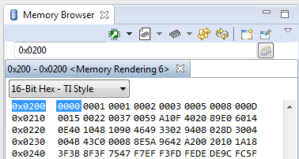

# Descriptive title - Computer Exercise #1 - Introduction to the MSP430 and Code Composer Studio

## By Capt Jeff Falkinburg

### Objectives or purpose 
This should include a paragraph on what is the goal of this assignment?

Remember, the purpose of the lab notebook is to communicate EVERYTHING you have done in pursuit of a particular project.  If you are sitting on the bus scribbling on the back of an envelope about your lab design, take a picture of that and include it with your work.  Without adequate documentation, your instructor won’t know what your thought process was and will not be able to grade you properly.  Once you leave the school environment, fellow engineers may need to pick up your project where you left off if you PCA, PCS, get hospitalized, or otherwise find yourself no longer working on something.  You will save your employer/co-workers/replacement a lot of time and money if you have left a detailed record for them to easily understand what you were doing, the approach you took, the tests you performed, and what you learned.

### Preliminary design
How will you start attacking the problem?
This should include detailed instructions of what you are about to do.  It may include PreLab material and also information from the Lab Handout.  Use pictures and data from Lab Handout.

### Software flow chart / algorithms
All coding include a pseudocode flow charts and algorithms defined your code and the algorithms used.  Visio or PowerPoint works well for this!

### Hardware schematic
If you are wiring things up you will need to create a schematic for your design.

### Well-formatted code
All your code will be in the code folder and contain headers, comments, and good coding practices.  Please reference the 

### Debugging
You should be keeping track of issues as you go along.  I didn't have any problems is not a good answer.  Describe the problems you had and what you did to fix it.  Again this is where I would say commit early and often and start your notebook when you start your code.

### Testing methodology / results
Detail the steps in getting the results you system is designed to achieve.  Have enough detail that someone can come behind and reproduce your results.

Display your results and describe them in detail so that anyone can understand.  For example Figure 1 below shows a screenshot of a memory dump for RAM from 0x0200 to 0x024E.  You will also describe to the reader what they are looking at.

##### Figure 1: Memory Dump Label (Always include figure labels!)

### Observations and Conclusions
During this whole assignment, what did you learn?  What did you notice that was noteworthy?  This should be a paragraph starting with the purpose, whether or not you achieved that purpose, what you learned, and how you can use this for future labs.

### Documentation
– always include this.  Any help received on any portion of the assignment, even from an instructor or the internet should be specifically mentioned.