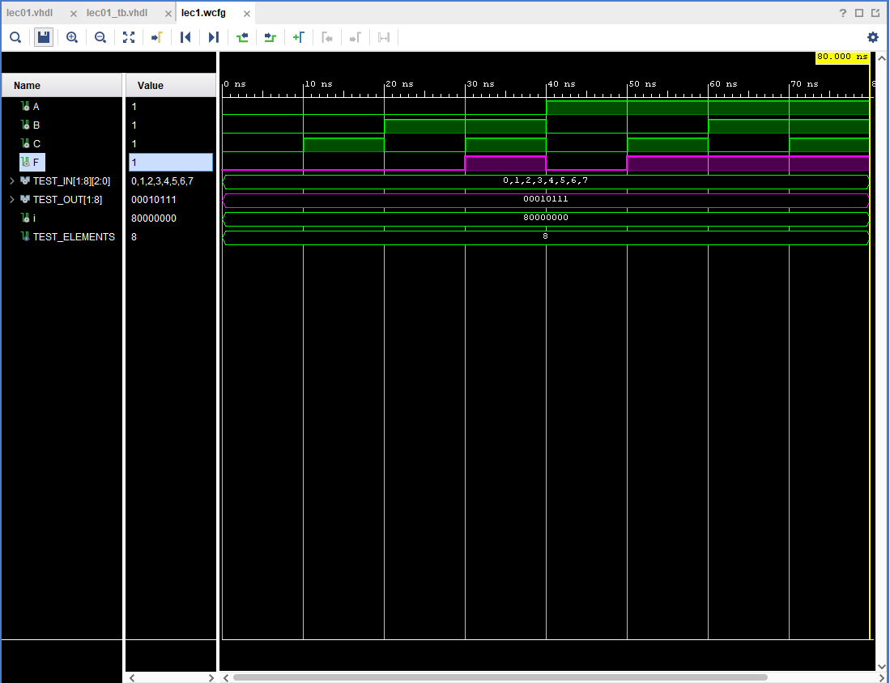

# CSCE 436 Example Project folder structure using the Majority circuit example in Lecture 1!

## By Prof Jeff Falkinburg

Below in Figure 1 is an example simulation of the Majority circuit from Lecture 1.

##### Figure 1: Majority Circuit Waveform from Lecture 1 